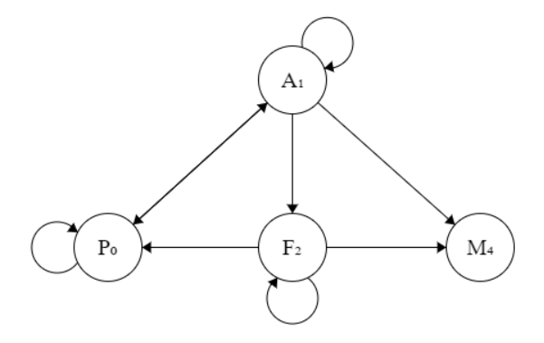

# NPC 👾
Este é um jogo de combate com inteligência artificial de um NPC (Non-player character - Personagem não-jogador).

## Tutorial 🕹️
O NPC pode estar em 4 estados diferentes:

| Estado | Descrição |
| --- | --- |
| Procurando | Se recupera de seus ferimentos e procura por inimigos |
| Atacando | Entra em combate aberto contra o inimigo |
| Fugindo | Desiste do combate e foge pela sobrevivência |
| Morto | Não sobreviveu ao combate e deve ser retirado do jogo |

As transições partem de `Procurando`, podem passar por  `Atacando` ou `Fugindo` até que o NPC seja `Eliminado`. 

Essas são as possíveis transições entre os estados:

 No fim, o programa exibe a quantidade de transições pelas quais o NPC sobreviveu.
 ### Exemplo:

 

## _Download_ 📥
Clique no botão abaixo para baixar o jogo.

[Baixe NPC aqui! ✅](dist/NPC.zip.zip)

`Após baixar, você deve descompactar e executar o arquivo.`

Caso não esteja utilizando o windows, execute o programa utilizando o seguinte comando:
`dotnet NPC.dll`.

## Realizadoras do projeto 👥
- [Beatriz Giovanna Moraes dos Santos](https://github.com/beatriz-moraess)
- [Beatriz Batista Santos](https://github.com/beatrizbatistasantos)
- [Lais Campos Martins](https://github.com/laiscampos1)

